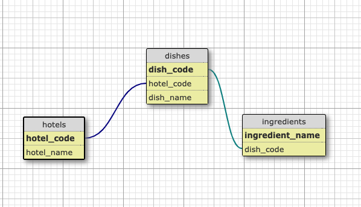

# Conception SID

Ce répertoire contient les datasets utilisés pendant le cours de Conception SID à l'ORT de Montreuil.

Pour chacun des datasets voici les questions auxquels je vous propose de répondre.

### dataset-1 & dataset-2

- Quelles sont les totaux des ventes journalières de chacun des 2 produits les plus vendus ?

### dataset-3

- Quels sont les 2 produits que les femmes achètent le plus le mercredi ?
- Combien dépensent en moyenne les hommes les samedi après midi?
- Comparez les produits qu'achètent les hommes et les femmes entre 17h et 21h ?
- Quels sont les 3 mois de l'année qui rapportent le plus de chiffres d'afffaire ?

Prix unitaires des produits

| sku    | unit-price |
| ------ | ---------- |
| 25CB99 | 31         |
| 87A4E4 | 38         |
| CC2B77 | 46         |
| AED206 | 39         |
| 9C88F3 | 25         |
| ECC5CE | 36         |
| 77AA3D | 44         |
| D8470A | 21         |
| 647EED | 40         |
| 4E3B4C | 28         |

### dataset-4

Vous êtes Business Analyst dans une entreprise qui fournit des ingrédients de repas dans les hotels dans le monde.

dataset-4 contient la liste de tous les contrats que vous avez déjà réalisés ainsi que les ingredients que vous avez déjà vendus.

Dès que vous avez déjà vendu un ingrédient à un hotel, vous disposez de la licence vous permettant de vendre ce même ingrédient à d'autres hotels.

leads.db est une base de données de potentiels hotels que vous pouvez contactez en vue de leur vendre des ingrédients que vous avez vendu à d'autres hotels.

Voici le schéma de la base de donnée:

#### Votre mission:

L'équipe Commercial a besoin de savoir quels sont les hotels à contacter pour leur vendre les ingrédients dont l'entreprise dispose une licence.
